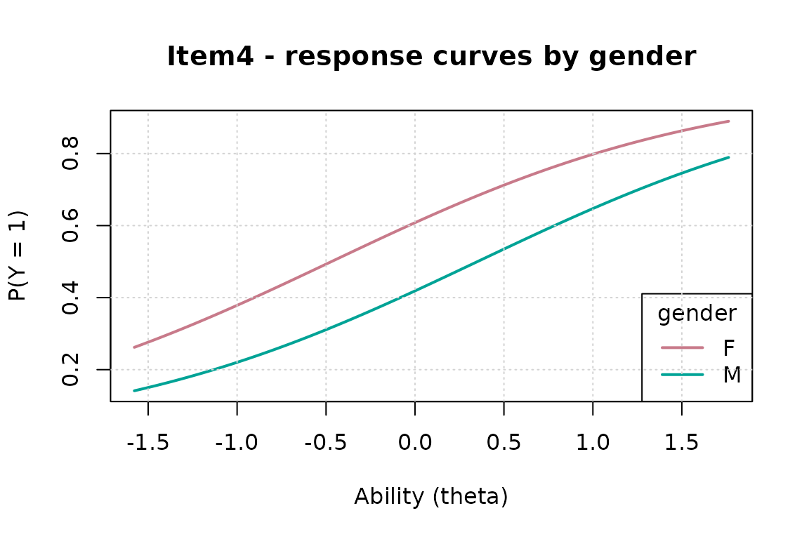

# Differential Item Functioning: Screening and Confirmation

## What DIF is — and what it is not

An item shows **differential item functioning** when respondents with
the *same* underlying ability but different group membership have
different success probabilities. The crucial contrast is with
**impact**: groups may genuinely differ in ability, and that alone is
not bias. Every defensible DIF analysis therefore conditions on a
matching criterion, and the central methodological risk is that the
criterion itself is contaminated by the DIF items.

gllammr implements a two-stage workflow:

1.  **[`dif_test()`](https://drjoshmcgrane.github.io/gllammr/reference/dif_test.md)**
    — fast logistic-regression screening with iterative purification,
    supporting multiple DIF variables and interactions.
2.  **[`dif_irt()`](https://drjoshmcgrane.github.io/gllammr/reference/dif_irt.md)**
    — confirmatory likelihood-ratio tests inside the joint IRT model,
    with a latent-regression impact term.

## Simulated example: two factors, one intersectional item

1,500 respondents crossed by gender and language; 12 items. Item 4 is
biased against one gender, item 8 against one language group, and item
11 only against the *combination* (intersectional DIF).

``` r

library(gllammr)
#> 
#> Attaching package: 'gllammr'
#> The following object is masked from 'package:stats':
#> 
#>     binomial
set.seed(2026)
n <- 1000; ni <- 12
persons <- data.frame(
  gender = factor(sample(c("F", "M"), n, TRUE)),
  lang   = factor(sample(c("majority", "minority"), n, TRUE)))
theta <- rnorm(n) - 0.4 * (persons$lang == "minority")  # impact!
b <- seq(-1.5, 1.5, length.out = ni)
resp <- sapply(seq_len(ni), function(j) {
  eta <- theta - b[j]
  if (j == 4)  eta <- eta - 0.8 * (persons$gender == "M")
  if (j == 8)  eta <- eta - 0.8 * (persons$lang == "minority")
  if (j == 11) eta <- eta - 1.0 * (persons$gender == "M") *
                             (persons$lang == "minority")
  rbinom(n, 1, plogis(eta))
})
```

Note the design includes **impact** (the minority-language group has a
lower latent mean), which a sound analysis must not mistake for DIF.

## Stage 1: screening with `dif_test()`

The formula interface carries both factors *and* their interaction; each
item gets a joint likelihood-ratio test against the matched criterion
(latent EAP score by default), with purification on:

``` r

screen <- dif_test(resp, dif = ~ gender * lang, person_data = persons)
print(screen)
#> Differential Item Functioning (DIF) Analysis
#> ==============================================
#> 
#> DIF specification: ~gender * lang ( 3 term(s) )
#> Matching: latent (2PL EAP) | Type: both 
#> Purification: 2 iteration(s), converged 
#> Items tested: 12 | flagged: 4 (alpha = 0.05  )
#> 
#> Flagged items:
#>  item   name   chisq df p_value  p_adj delta_R2 classification flagged
#>     3  Item3 16.1108  6  0.0132 0.0132   0.0201              A    TRUE
#>     4  Item4 31.2508  6  0.0000 0.0000   0.0375              B    TRUE
#>     8  Item8 36.6802  6  0.0000 0.0000   0.0459              B    TRUE
#>    11 Item11 39.2483  6  0.0000 0.0000   0.0554              B    TRUE
```

All three DIF items — including the purely intersectional item 11, which
no single-factor analysis could attribute correctly — are flagged, with
Nagelkerke $`\Delta R^2`$ effect sizes and the Jodoin–Gierl A/B/C
labels. The purification trace shows the matching criterion was
re-derived after flagging, so the biased items no longer contaminate it.

Response curves for any flagged item, by any factor:

``` r

dif_plot(screen, item = 4, by = "gender")
```



Two practical options worth knowing: `p_adjust = "BH"` controls the
false discovery rate across items, and `match = "score"` switches to the
classical observed-score criterion (with which the results reproduce
[`difR::difLogistic`](https://rdrr.io/pkg/difR/man/difLogistic.html)
exactly).

## Stage 2: confirmation with `dif_irt()`

Screening conditions on an *estimated* score. The confirmatory model
puts DIF inside the joint marginal-likelihood IRT model: item-by-
covariate interactions for the studied items, plus a **latent
regression**
$`\theta_p \sim N(\mathbf z_p'\boldsymbol\gamma, \sigma^2)`$ that
absorbs impact. Anchoring on the screened-clean items:

``` r

confirm <- dif_irt(resp, dif = ~ gender * lang, person_data = persons,
                   items = screen$flagged_items,
                   anchors = setdiff(seq_len(ni), screen$flagged_items))
print(confirm)
#> Confirmatory IRT DIF analysis (Rasch, uniform DIF, LR tests)
#> DIF specification: ~gender * lang 
#> Anchors: 1, 2, 5, 6, 7, 9, 10, 12 
#> 
#> Impact (latent regression of ability on the DIF variables):
#>                  term   gamma     se       z
#>               genderM -0.1384 0.1075 -1.2871
#>          langminority -0.4337 0.1121 -3.8670
#>  genderM:langminority  0.2724 0.1547  1.7606
#> 
#> Items flagged: 4, 8, 11 (alpha = 0.05 )
#>  item   name   chisq df p_value  p_adj flagged delta_genderM delta_langminority
#>     3  Item3  7.1750  3  0.0665 0.0665   FALSE        0.5442             0.1089
#>     4  Item4 31.0143  3  0.0000 0.0000    TRUE       -0.7982             0.2075
#>     8  Item8 19.7072  3  0.0002 0.0002    TRUE        0.1094            -0.5467
#>    11 Item11 21.9010  3  0.0001 0.0001    TRUE        0.0216            -0.1503
#>  delta_genderM.langminority
#>                     -0.4322
#>                      0.0606
#>                     -0.2619
#>                     -0.9945
```

Two things to read off. First, the **impact** block: the latent
regression recovers the minority-language ability difference as a group
mean difference — *not* as item bias. Second, each confirmed item’s
$`\delta`$ estimates are on the logit metric with standard errors: the
size of the bias at equal ability, ready to report.

For the Rasch model these tests are likelihood-identical to the De Boeck
& Wilson long-format GLMM
(`y ~ 0 + item + z + item_j:z + (1 | person)`); the package validates
this against lme4 to three decimals.

## Why two stages

The screening test is fast (one small regression per item per round) and
robust as an exploratory sweep, but its matching criterion — however
purified — is an estimate, and with heavy, same-direction DIF the
DIF/impact decomposition can become unidentified (in that case
[`dif_test()`](https://drjoshmcgrane.github.io/gllammr/reference/dif_test.md)
warns explicitly rather than returning confident nonsense). The
confirmatory model handles impact by construction, gives effect sizes
with standard errors in the latent metric, and supports nonuniform DIF
for the 2PL (`type = "both"`); its cost is one IRT fit per studied item.
Screen wide, confirm narrow.

## Polytomous items and purification breakdown

[`dif_test()`](https://drjoshmcgrane.github.io/gllammr/reference/dif_test.md)
handles polytomous items via cumulative-logit regression automatically.
And if purification ever removes (almost) every item from the anchor —
the signature of a test where too large a fraction shares same-direction
DIF — the analysis warns that substantive anchor knowledge is required;
supply known-clean `anchors` and re-run.

## References

- Swaminathan, H., & Rogers, H. J. (1990). Detecting differential item
  functioning using logistic regression procedures. *Journal of
  Educational Measurement*, 27, 361–370.
- Thissen, D., Steinberg, L., & Wainer, H. (1993). Detection of
  differential item functioning using the parameters of item response
  models. In *Differential Item Functioning*. Erlbaum.
- Candell, G. L., & Drasgow, F. (1988). An iterative procedure for
  linking metrics and assessing item bias in item response theory.
  *Applied Psychological Measurement*, 12, 253–260.
- Jodoin, M. G., & Gierl, M. J. (2001). Evaluating type I error and
  power rates using an effect size measure with the logistic regression
  procedure for DIF detection. *Applied Measurement in Education*, 14,
  329–349.
