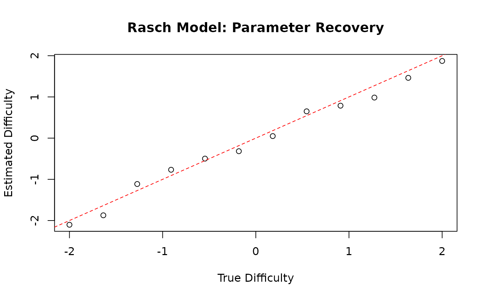
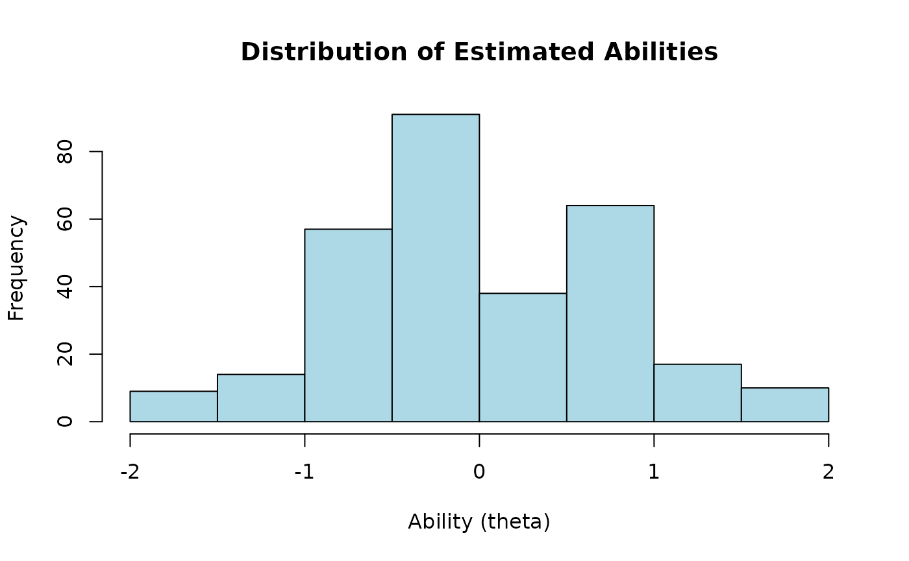
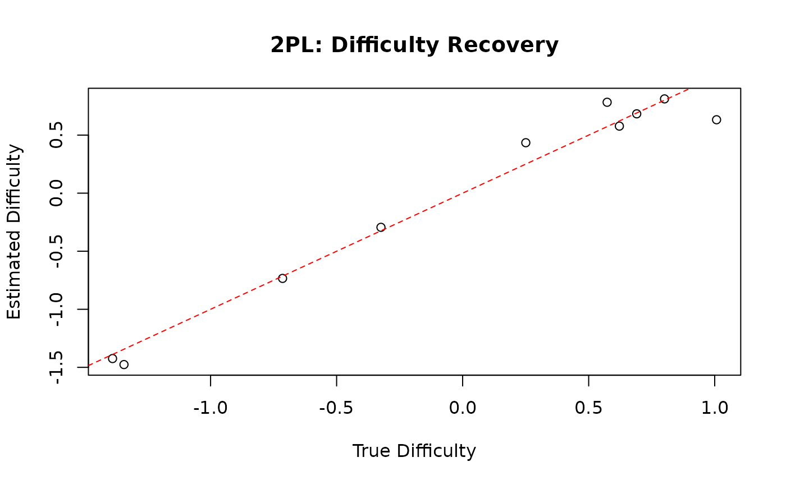
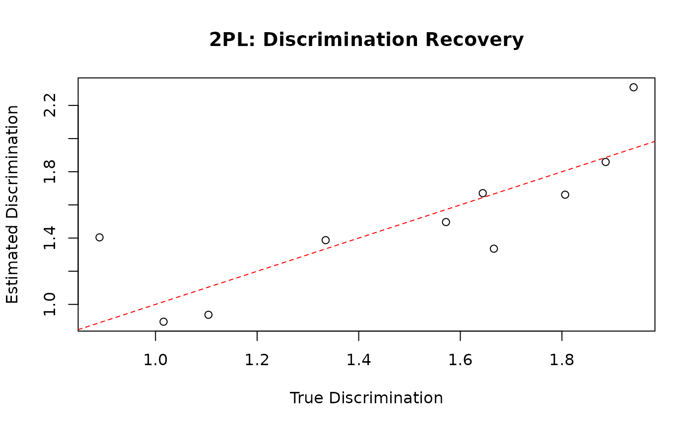
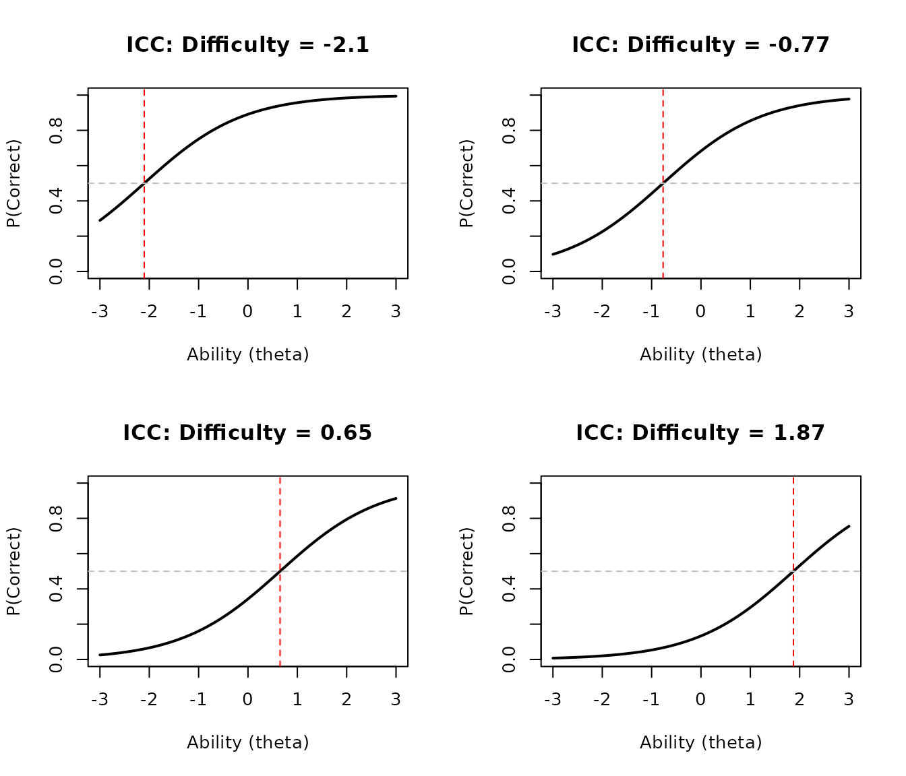
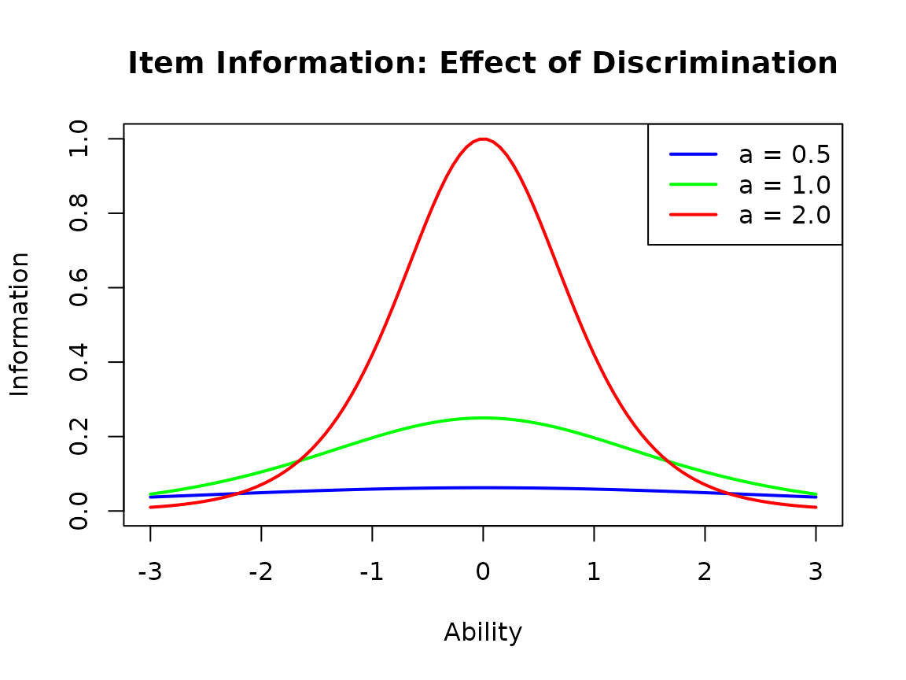
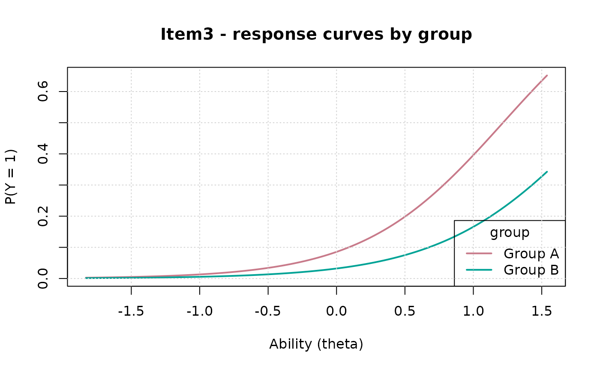

# Item Response Theory Models with gllammr

## Introduction to IRT

Item Response Theory (IRT) provides a framework for analyzing test and
survey data. IRT models relate person abilities (latent traits) to item
responses through mathematical functions.

gllammr implements the major IRT models:

- **Dichotomous**: Rasch (1PL), 2PL, 3PL
- **Polytomous**: Graded Response Model (GRM), Partial Credit Model
  (PCM), Generalized Partial Credit Model (GPCM), Nominal Response Model
  (NRM)

plus differential item functioning (DIF) analysis and explanatory IRT
(EIRT) with item covariates.

Identification note: for the Rasch model the latent ability variance is
estimated; for 2PL/3PL and the polytomous models the latent variance is
fixed at 1 so that item discriminations are identified.

## The Rasch Model

The Rasch model is the simplest IRT model:

``` math
P(Y_{ij} = 1 | \theta_i, b_j) = \frac{1}{1 + \exp(-(\theta_i - b_j))}
```

where:

- $`\theta_i`$ is the ability of person $`i`$
- $`b_j`$ is the difficulty of item $`j`$

### Simulating Rasch Data

``` r

library(gllammr)
#> 
#> Attaching package: 'gllammr'
#> The following object is masked from 'package:stats':
#> 
#>     binomial

set.seed(123)
n_persons <- 300
n_items <- 12

# True parameters
true_ability <- rnorm(n_persons, mean = 0, sd = 1)
true_difficulty <- seq(-2, 2, length.out = n_items)

# Generate responses
responses <- matrix(NA, n_persons, n_items)
for (j in 1:n_items) {
  p <- plogis(true_ability - true_difficulty[j])
  responses[, j] <- rbinom(n_persons, 1, p)
}
colnames(responses) <- paste0("Item", 1:n_items)

head(responses)
#>      Item1 Item2 Item3 Item4 Item5 Item6 Item7 Item8 Item9 Item10 Item11 Item12
#> [1,]     1     0     0     0     0     1     1     0     0      0      0      0
#> [2,]     1     1     0     0     0     0     1     1     1      0      0      0
#> [3,]     1     1     1     1     1     1     1     1     1      1      0      1
#> [4,]     1     1     1     1     0     0     1     1     0      0      0      0
#> [5,]     1     1     1     1     1     0     1     0     0      1      0      0
#> [6,]     1     1     0     1     1     1     1     0     1      1      0      0
```

### Fitting the Rasch Model

``` r

fit_rasch <- fit_irt(responses, model = "Rasch")

print(fit_rasch)
#> IRT Model (Rasch)
#> 
#> Number of persons: 300 
#> Number of items: 12 
#> Model type: Dichotomous
#> 
#> Item parameters:
#>        difficulty discrimination guessing
#> Item1      -2.102              1       NA
#> Item2      -1.873              1       NA
#> Item3      -1.114              1       NA
#> Item4      -0.767              1       NA
#> Item5      -0.497              1       NA
#> Item6      -0.317              1       NA
#> Item7       0.049              1       NA
#> Item8       0.650              1       NA
#> Item9       0.788              1       NA
#> Item10      0.984              1       NA
#> Item11      1.463              1       NA
#> Item12      1.872              1       NA
#> 
#> Ability distribution:
#>   Mean: 0 
#>   SD: 0.731 
#>   Estimated SD: 0.928 
#> 
#> Log-likelihood: -2015.18 
#> AIC: 4056.37 
#> BIC: 4104.51
```

### Examining Item Parameters

``` r

# Item difficulties
item_params <- fit_rasch$item_parameters
print(item_params)
#>         difficulty discrimination guessing
#> Item1  -2.10227820              1       NA
#> Item2  -1.87298567              1       NA
#> Item3  -1.11360559              1       NA
#> Item4  -0.76734192              1       NA
#> Item5  -0.49674303              1       NA
#> Item6  -0.31740396              1       NA
#> Item7   0.04946506              1       NA
#> Item8   0.65032480              1       NA
#> Item9   0.78767957              1       NA
#> Item10  0.98441837              1       NA
#> Item11  1.46285886              1       NA
#> Item12  1.87246809              1       NA

# Plot item difficulties
plot(true_difficulty, item_params$difficulty,
     xlab = "True Difficulty",
     ylab = "Estimated Difficulty",
     main = "Rasch Model: Parameter Recovery")
abline(0, 1, col = "red", lty = 2)
```



### Examining Person Parameters

``` r

# Person abilities (empirical Bayes estimates)
abilities_rasch <- fit_rasch$person_abilities

# Distribution of abilities
hist(abilities_rasch, main = "Distribution of Estimated Abilities",
     xlab = "Ability (theta)", col = "lightblue")
```



``` r


# Correlation with true abilities
cor(abilities_rasch, true_ability)
#> [1] 0.7728665
```

## The 2PL Model

The 2-parameter logistic model adds item discrimination:

``` math
P(Y_{ij} = 1 | \theta_i, a_j, b_j) = \frac{1}{1 + \exp(-a_j(\theta_i - b_j))}
```

where $`a_j`$ is the discrimination parameter for item $`j`$: higher
$`a_j`$ means the item better distinguishes between ability levels.

### Simulating 2PL Data

``` r

set.seed(456)
n_items_2pl <- 10

true_difficulty_2pl <- rnorm(n_items_2pl, 0, 1)
true_discrimination <- runif(n_items_2pl, 0.8, 2.0)

responses_2pl <- matrix(NA, n_persons, n_items_2pl)
for (j in 1:n_items_2pl) {
  p <- plogis(true_discrimination[j] * (true_ability - true_difficulty_2pl[j]))
  responses_2pl[, j] <- rbinom(n_persons, 1, p)
}
colnames(responses_2pl) <- paste0("Q", 1:n_items_2pl)
```

### Fitting the 2PL Model

``` r

fit_2pl <- fit_irt(responses_2pl, model = "2PL")

print(fit_2pl)
#> IRT Model (2PL)
#> 
#> Number of persons: 300 
#> Number of items: 10 
#> Model type: Dichotomous
#> 
#> Item parameters:
#>        difficulty discrimination guessing
#> Item1      -1.476          0.896       NA
#> Item2       0.577          1.336       NA
#> Item3       0.812          1.859       NA
#> Item4      -1.424          1.387       NA
#> Item5      -0.734          1.662       NA
#> Item6      -0.294          1.671       NA
#> Item7       0.683          2.309       NA
#> Item8       0.434          1.497       NA
#> Item9       0.632          1.404       NA
#> Item10      0.783          0.937       NA
#> 
#> Ability distribution:
#>   Mean: 0.012 
#>   SD: 0.835 
#>   Estimated SD: 1 
#> 
#> Log-likelihood: -1629.9 
#> AIC: 3299.81 
#> BIC: 3373.88
summary(fit_2pl)
#> IRT Model (2PL)
#> 
#> Number of persons: 300 
#> Number of items: 10 
#> Model type: Dichotomous
#> 
#> Item parameters:
#>        difficulty discrimination guessing
#> Item1      -1.476          0.896       NA
#> Item2       0.577          1.336       NA
#> Item3       0.812          1.859       NA
#> Item4      -1.424          1.387       NA
#> Item5      -0.734          1.662       NA
#> Item6      -0.294          1.671       NA
#> Item7       0.683          2.309       NA
#> Item8       0.434          1.497       NA
#> Item9       0.632          1.404       NA
#> Item10      0.783          0.937       NA
#> 
#> Ability distribution:
#>   Mean: 0.012 
#>   SD: 0.835 
#>   Estimated SD: 1 
#> 
#> Log-likelihood: -1629.9 
#> AIC: 3299.81 
#> BIC: 3373.88 
#> 
#> Ability quartiles:
#>          0%         25%         50%         75%        100% 
#> -1.68865676 -0.55753582  0.03603969  0.56226592  1.67711858
```

### Comparing Item Parameters

``` r

difficulty_2pl <- fit_2pl$item_parameters$difficulty
discrimination_2pl <- fit_2pl$item_parameters$discrimination

plot(true_difficulty_2pl, difficulty_2pl,
     xlab = "True Difficulty", ylab = "Estimated Difficulty",
     main = "2PL: Difficulty Recovery")
abline(0, 1, col = "red", lty = 2)
```



``` r


plot(true_discrimination, discrimination_2pl,
     xlab = "True Discrimination", ylab = "Estimated Discrimination",
     main = "2PL: Discrimination Recovery")
abline(0, 1, col = "red", lty = 2)
```



## The 3PL Model

The 3-parameter logistic model adds a guessing parameter:

``` math
P(Y_{ij} = 1 | \theta_i, a_j, b_j, c_j) = c_j + (1 - c_j) \frac{1}{1 + \exp(-a_j(\theta_i - b_j))}
```

where $`c_j`$ is the pseudo-guessing parameter (lower asymptote). Note
that 3PL guessing parameters are weakly identified in small samples;
large datasets are recommended in practice.

``` r

set.seed(789)
true_guessing <- runif(n_items_2pl, 0.1, 0.3)

responses_3pl <- matrix(NA, n_persons, n_items_2pl)
for (j in 1:n_items_2pl) {
  p <- true_guessing[j] + (1 - true_guessing[j]) *
       plogis(true_discrimination[j] * (true_ability - true_difficulty_2pl[j]))
  responses_3pl[, j] <- rbinom(n_persons, 1, p)
}

fit_3pl <- fit_irt(responses_3pl, model = "3PL")
#> Warning in sqrt(diag(cov)): NaNs produced
#> Warning: Hessian not positive definite for IRT model; standard errors are
#> unreliable. The model may be over-parameterized or a variance component may be
#> near zero.

print(fit_3pl)
#> IRT Model (3PL)
#> 
#> Number of persons: 300 
#> Number of items: 10 
#> Model type: Dichotomous
#> 
#> Item parameters:
#>        difficulty discrimination guessing
#> Item1      -1.837          0.919    0.001
#> Item2       0.349          0.912    0.001
#> Item3       0.547          1.242    0.001
#> Item4      -1.731          1.130    0.001
#> Item5      -1.209          1.563    0.001
#> Item6      -0.462          1.532    0.001
#> Item7       0.639          1.628    0.228
#> Item8      -0.014          1.589    0.001
#> Item9       1.402          2.135    0.319
#> Item10      0.882          2.169    0.362
#> 
#> Ability distribution:
#>   Mean: 0.02 
#>   SD: 0.826 
#>   Estimated SD: 1 
#> 
#> Log-likelihood: -1745.81 
#> AIC: 3551.63 
#> BIC: 3662.74
```

## Item Characteristic Curves

The [`plot()`](https://rdrr.io/r/graphics/plot.default.html) method
draws item characteristic curves, item/test information, and the ability
distribution; here we draw a Rasch ICC by hand:

``` r

plot_icc_rasch <- function(difficulty, theta_range = c(-3, 3)) {
  theta <- seq(theta_range[1], theta_range[2], length.out = 100)
  p <- plogis(theta - difficulty)

  plot(theta, p, type = "l", lwd = 2,
       xlab = "Ability (theta)",
       ylab = "P(Correct)",
       main = paste("ICC: Difficulty =", round(difficulty, 2)),
       ylim = c(0, 1))
  abline(h = 0.5, col = "gray", lty = 2)
  abline(v = difficulty, col = "red", lty = 2)
}

oldpar <- par(mfrow = c(2, 2))
plot_icc_rasch(item_params$difficulty[1])
plot_icc_rasch(item_params$difficulty[4])
plot_icc_rasch(item_params$difficulty[8])
plot_icc_rasch(item_params$difficulty[12])
```



``` r

par(oldpar)
```

## Item Information Functions

``` r

item_information_2pl <- function(theta, a, b) {
  p <- plogis(a * (theta - b))
  a^2 * p * (1 - p)
}

theta_grid <- seq(-3, 3, length.out = 100)

plot(theta_grid, item_information_2pl(theta_grid, a = 0.5, b = 0),
     type = "l", lwd = 2, col = "blue",
     xlab = "Ability", ylab = "Information",
     main = "Item Information: Effect of Discrimination",
     ylim = c(0, 1))
lines(theta_grid, item_information_2pl(theta_grid, a = 1.0, b = 0),
      lwd = 2, col = "green")
lines(theta_grid, item_information_2pl(theta_grid, a = 2.0, b = 0),
      lwd = 2, col = "red")
legend("topright",
       legend = c("a = 0.5", "a = 1.0", "a = 2.0"),
       col = c("blue", "green", "red"),
       lwd = 2)
```



## Model Comparison

Models fitted to the *same* data can be compared with information
criteria. Here we fit both Rasch and 2PL to the 2PL data:

``` r

fit_rasch_on_2pl <- fit_irt(responses_2pl, model = "Rasch")

comparison <- data.frame(
  Model = c("Rasch", "2PL"),
  LogLik = c(fit_rasch_on_2pl$logLik, fit_2pl$logLik),
  AIC = c(fit_rasch_on_2pl$AIC, fit_2pl$AIC),
  BIC = c(fit_rasch_on_2pl$BIC, fit_2pl$BIC)
)

print(comparison)
#>   Model    LogLik      AIC      BIC
#> 1 Rasch -1641.048 3304.096 3344.837
#> 2   2PL -1629.903 3299.806 3373.882
# Lower AIC/BIC is better; 2PL should fit better here because the
# generating discriminations vary across items
```

## Ability Estimation

``` r

# Create ability score groups
ability_groups <- cut(abilities_rasch,
                      breaks = quantile(abilities_rasch, c(0, 0.25, 0.5, 0.75, 1)),
                      include.lowest = TRUE,
                      labels = c("Low", "Medium-Low", "Medium-High", "High"))

# Average proportion correct by ability group
score_by_group <- tapply(rowMeans(responses), ability_groups, mean)
print(score_by_group)
#>         Low  Medium-Low Medium-High        High 
#>   0.2511111   0.4522222   0.5777778   0.7622222
```

## Polytomous IRT Models

### Graded Response Model (GRM)

The Graded Response Model is used for ordered categorical responses
(e.g., Likert scales):

``` math
P(Y_{ij} \geq k | \theta_i, a_j, b_{jk}) = \frac{1}{1 + \exp(-a_j(\theta_i - b_{jk}))}
```

where $`b_{j1} < b_{j2} < ... < b_{j,K-1}`$ are ordered thresholds.

#### Simulating GRM Data

``` r

set.seed(123)
n_persons_grm <- 200
n_items_grm <- 8
n_categories <- 4

theta_grm <- rnorm(n_persons_grm, 0, 1)
discrimination_grm <- runif(n_items_grm, 0.8, 2.0)
difficulty_base <- rnorm(n_items_grm, 0, 1)

responses_grm <- matrix(NA, n_persons_grm, n_items_grm)
for (j in 1:n_items_grm) {
  # Ordered thresholds centered around the item difficulty
  thresholds <- difficulty_base[j] + seq(-1.5, 1.5, length.out = n_categories - 1)

  for (i in 1:n_persons_grm) {
    # Cumulative probabilities P(Y >= k), k = 2..K
    cum <- plogis(discrimination_grm[j] * (theta_grm[i] - thresholds))
    # Category probabilities P(Y = k)
    probs <- c(1 - cum[1], -diff(cum), cum[n_categories - 1])
    responses_grm[i, j] <- sample(1:n_categories, 1, prob = probs)
  }
}

# View response distribution for the first item
table(responses_grm[, 1])
#> 
#>  1  2  3  4 
#>  8 68 82 42
```

#### Fitting the GRM

``` r

fit_grm <- fit_irt(responses_grm, model = "GRM")

print(fit_grm)
#> IRT Model (GRM)
#> 
#> Number of persons: 200 
#> Number of items: 8 
#> Model type: Polytomous (max 4 categories)
#> 
#> Item discriminations:
#> Item1 Item2 Item3 Item4 Item5 Item6 Item7 Item8 
#> 1.760 1.046 1.790 1.409 1.454 1.362 1.301 1.183 
#> 
#> Item thresholds (first 5 items):
#>   Item 1 : -2.471, -0.448, 1.12 
#>   Item 2 : -2.19, -0.547, 0.92 
#>   Item 3 : -2.912, -0.853, 0.638 
#>   Item 4 : -2.567, -0.539, 0.788 
#>   Item 5 : 0.18, 1.69, 3.209 
#>   ... ( 3  more items)
#> 
#> Ability distribution:
#>   Mean: 0 
#>   SD: 0.892 
#>   Estimated SD: 1 
#> 
#> Log-likelihood: -1829.52 
#> AIC: 3723.04 
#> BIC: 3828.58
summary(fit_grm)
#> IRT Model (GRM)
#> 
#> Number of persons: 200 
#> Number of items: 8 
#> Model type: Polytomous (max 4 categories)
#> 
#> Item discriminations:
#> Item1 Item2 Item3 Item4 Item5 Item6 Item7 Item8 
#> 1.760 1.046 1.790 1.409 1.454 1.362 1.301 1.183 
#> 
#> Item thresholds (first 5 items):
#>   Item 1 : -2.471, -0.448, 1.12 
#>   Item 2 : -2.19, -0.547, 0.92 
#>   Item 3 : -2.912, -0.853, 0.638 
#>   Item 4 : -2.567, -0.539, 0.788 
#>   Item 5 : 0.18, 1.69, 3.209 
#>   ... ( 3  more items)
#> 
#> Ability distribution:
#>   Mean: 0 
#>   SD: 0.892 
#>   Estimated SD: 1 
#> 
#> Log-likelihood: -1829.52 
#> AIC: 3723.04 
#> BIC: 3828.58 
#> 
#> Ability quartiles:
#>          0%         25%         50%         75%        100% 
#> -2.13275663 -0.64407092 -0.04514485  0.47743270  2.21956811
```

#### Examining GRM Parameters

``` r

# Item discriminations
discriminations <- fit_grm$item_parameters$discrimination
print(head(discriminations))
#>    Item1    Item2    Item3    Item4    Item5    Item6 
#> 1.759859 1.045923 1.790052 1.409422 1.453734 1.361920

# Thresholds (one per category transition)
thresholds <- fit_grm$item_parameters$thresholds
print(thresholds[[1]])  # Thresholds for first item
#> [1] -2.4707446 -0.4480616  1.1202966
```

### Partial Credit Model (PCM)

The Partial Credit Model is used for partial credit scoring:

``` math
P(Y_{ij} = k | \theta_i, \delta_{jk}) = \frac{\exp(\sum_{h=0}^{k}(\theta_i - \delta_{jh}))}{\sum_{m=0}^{K}\exp(\sum_{h=0}^{m}(\theta_i - \delta_{jh}))}
```

``` r

# PCM constrains discrimination = 1 for all items
fit_pcm <- fit_irt(responses_grm, model = "PCM")

print(fit_pcm)
#> IRT Model (PCM)
#> 
#> Number of persons: 200 
#> Number of items: 8 
#> Model type: Polytomous (max 4 categories)
#> 
#> Item discriminations:
#> Item1 Item2 Item3 Item4 Item5 Item6 Item7 Item8 
#>     1     1     1     1     1     1     1     1 
#> 
#> Item thresholds (first 5 items):
#>   Item 1 : -2.9, -0.373, 1.097 
#>   Item 2 : -1.392, -0.279, 0.324 
#>   Item 3 : -3.415, -0.825, 0.525 
#>   Item 4 : -2.516, -0.262, 0.41 
#>   Item 5 : 0.504, 1.541, 2.677 
#>   ... ( 3  more items)
#> 
#> Ability distribution:
#>   Mean: 0.002 
#>   SD: 0.8 
#>   Estimated SD: 0.921 
#> 
#> Log-likelihood: -1844.18 
#> AIC: 3738.37 
#> BIC: 3820.82
```

### Generalized Partial Credit Model (GPCM)

GPCM extends PCM by allowing item-specific discriminations:

``` r

fit_gpcm <- fit_irt(responses_grm, model = "GPCM")

print(fit_gpcm)
#> IRT Model (GPCM)
#> 
#> Number of persons: 200 
#> Number of items: 8 
#> Model type: Polytomous (max 4 categories)
#> 
#> Item discriminations:
#> Item1 Item2 Item3 Item4 Item5 Item6 Item7 Item8 
#> 1.417 0.612 1.443 0.954 1.061 0.848 0.916 0.662 
#> 
#> Item thresholds (first 5 items):
#>   Item 1 : -2.516, -0.38, 1.036 
#>   Item 2 : -1.76, -0.325, 0.249 
#>   Item 3 : -2.924, -0.787, 0.533 
#>   Item 4 : -2.677, -0.291, 0.449 
#>   Item 5 : 0.461, 1.581, 2.779 
#>   ... ( 3  more items)
#> 
#> Ability distribution:
#>   Mean: 0.001 
#>   SD: 0.877 
#>   Estimated SD: 1 
#> 
#> Log-likelihood: -1834.06 
#> AIC: 3732.12 
#> BIC: 3837.67
```

### Nominal Response Model (NRM)

NRM is for unordered categorical responses (no natural ordering):

``` r

# Simulate nominal responses (e.g., multiple choice with plausible distractors)
set.seed(456)
responses_nrm <- matrix(sample(1:4, 200 * 8, replace = TRUE), 200, 8)

fit_nrm <- fit_irt(responses_nrm, model = "NRM")
print(fit_nrm)
#> IRT Model (NRM)
#> 
#> Number of persons: 200 
#> Number of items: 8 
#> Model type: Polytomous (max 4 categories)
#> 
#> Item discriminations:
#>  Item1  Item2  Item3  Item4  Item5  Item6  Item7  Item8 
#>  0.124  0.050  0.050  0.059  0.050  0.050  0.050 10.000 
#> 
#> Item thresholds (first 5 items):
#>   Item 1 : -0.268, 0.464, 1.365 
#>   Item 2 : 0.001, 0.872, 1.705 
#>   Item 3 : -0.227, 0.604, 1.367 
#>   Item 4 : 0.074, 0.81, 1.773 
#>   Item 5 : 0.208, 1.876, 3.108 
#>   ... ( 3  more items)
#> 
#> Ability distribution:
#>   Mean: -0.185 
#>   SD: 0.392 
#>   Estimated SD: 1 
#> 
#> Log-likelihood: -2180.04 
#> AIC: 4424.08 
#> BIC: 4529.63
```

### Comparing Polytomous Models

``` r

comparison_poly <- data.frame(
  Model = c("GRM", "PCM", "GPCM"),
  LogLik = c(fit_grm$logLik, fit_pcm$logLik, fit_gpcm$logLik),
  AIC = c(fit_grm$AIC, fit_pcm$AIC, fit_gpcm$AIC),
  BIC = c(fit_grm$BIC, fit_pcm$BIC, fit_gpcm$BIC)
)

print(comparison_poly)
#>   Model    LogLik      AIC      BIC
#> 1   GRM -1829.519 3723.038 3828.584
#> 2   PCM -1844.183 3738.367 3820.825
#> 3  GPCM -1834.061 3732.122 3837.668
# GRM/GPCM typically fit better than PCM if discriminations vary;
# PCM is more parsimonious (fewer parameters)
```

## Differential Item Functioning (DIF)

DIF analysis tests whether items function differently across groups
(e.g., gender, ethnicity, language).

- **Uniform DIF**: item difficulty differs between groups (parallel
  ICCs)
- **Non-uniform DIF**: item discrimination differs between groups
  (non-parallel ICCs)

### Simulating Data with DIF

``` r

set.seed(789)
n_persons_dif <- 300
n_items_dif <- 12

group <- rep(c("Group A", "Group B"), each = n_persons_dif / 2)
theta_dif <- rnorm(n_persons_dif, 0, 1)

difficulty_dif <- rnorm(n_items_dif, 0, 1)
discrimination_dif <- runif(n_items_dif, 0.8, 2.0)

# Add uniform DIF to items 3, 6, and 9 for Group B
dif_items <- c(3, 6, 9)
dif_amount <- c(0.8, 1.2, -0.6)

responses_dif <- matrix(NA, n_persons_dif, n_items_dif)
for (i in 1:n_persons_dif) {
  for (j in 1:n_items_dif) {
    diff_effective <- difficulty_dif[j]
    if (j %in% dif_items && group[i] == "Group B") {
      diff_effective <- diff_effective + dif_amount[which(dif_items == j)]
    }
    p <- plogis(discrimination_dif[j] * (theta_dif[i] - diff_effective))
    responses_dif[i, j] <- rbinom(1, 1, p)
  }
}
```

### Testing for DIF

``` r

dif_result <- dif_test(
  responses_dif,
  dif = group,
  model = "2PL",
  purify = TRUE,
  alpha = 0.05
)

print(dif_result)
#> Differential Item Functioning (DIF) Analysis
#> ==============================================
#> 
#> DIF specification: ~group ( 1 term(s) )
#> Matching: latent (2PL EAP) | Type: both 
#> Purification: 3 iteration(s), converged 
#> Items tested: 12 | flagged: 3 (alpha = 0.05  )
#> 
#> Flagged items:
#>  item  name   chisq df p_value  p_adj delta_R2 classification flagged
#>     3 Item3  7.9444  2  0.0188 0.0188   0.0440              B    TRUE
#>     6 Item6 43.7753  2  0.0000 0.0000   0.1678              C    TRUE
#>     9 Item9  8.8885  2  0.0117 0.0117   0.0577              B    TRUE
```

[`dif_test()`](https://drjoshmcgrane.github.io/gllammr/reference/dif_test.md)
uses logistic-regression DIF with a latent (EAP) matching criterion and
iterative purification: items flagged in one round are removed from the
matching criterion for the next, so DIF items do not contaminate the
score against which DIF is judged. Multiple DIF variables and their
interactions are specified with a formula, e.g.
`dif = ~ gender * language` with `person_data`.

### Interpreting DIF Results

``` r

summary(dif_result)
#> Differential Item Functioning (DIF) Analysis
#> ==============================================
#> 
#> DIF specification: ~group ( 1 term(s) )
#> Matching: latent (2PL EAP) | Type: both 
#> Purification: 3 iteration(s), converged 
#> Items tested: 12 | flagged: 3 (alpha = 0.05  )
#> 
#> Flagged items:
#>  item  name   chisq df p_value  p_adj delta_R2 classification flagged
#>     3 Item3  7.9444  2  0.0188 0.0188   0.0440              B    TRUE
#>     6 Item6 43.7753  2  0.0000 0.0000   0.1678              C    TRUE
#>     9 Item9  8.8885  2  0.0117 0.0117   0.0577              B    TRUE
#> 
#> All items:
#>  item   name   chisq df p_value  p_adj delta_R2 classification flagged
#>     1  Item1  0.7717  2  0.6799 0.6799   0.0026              A   FALSE
#>     2  Item2  1.1754  2  0.5556 0.5556   0.0042              A   FALSE
#>     3  Item3  7.9444  2  0.0188 0.0188   0.0440              B    TRUE
#>     4  Item4  1.3234  2  0.5160 0.5160   0.0037              A   FALSE
#>     5  Item5  0.4617  2  0.7939 0.7939   0.0017              A   FALSE
#>     6  Item6 43.7753  2  0.0000 0.0000   0.1678              C    TRUE
#>     7  Item7  2.8162  2  0.2446 0.2446   0.0099              A   FALSE
#>     8  Item8  1.8191  2  0.4027 0.4027   0.0052              A   FALSE
#>     9  Item9  8.8885  2  0.0117 0.0117   0.0577              B    TRUE
#>    10 Item10  0.0955  2  0.9534 0.9534   0.0003              A   FALSE
#>    11 Item11  0.9224  2  0.6305 0.6305   0.0026              A   FALSE
#>    12 Item12  1.6102  2  0.4471 0.4471   0.0050              A   FALSE
#> 
#> Effect sizes: Nagelkerke delta-R2 between the compared models;
#> A < 0.035 (negligible), B < 0.07 (moderate), C (large)

# Items flagged for DIF
cat("Flagged items:", dif_result$flagged_items, "\n")
#> Flagged items: 3 6 9

# Effect sizes for flagged items
dif_results_df <- dif_result$dif_results
flagged_df <- dif_results_df[dif_results_df$item %in% dif_result$flagged_items, ]
print(flagged_df)
#>   item  name     chisq df      p_value        p_adj   delta_R2 classification
#> 3    3 Item3  7.944355  2 1.883238e-02 1.883238e-02 0.04399764              B
#> 6    6 Item6 43.775300  2 3.121148e-10 3.121148e-10 0.16782997              C
#> 9    9 Item9  8.888460  2 1.174615e-02 1.174615e-02 0.05765706              B
#>   flagged
#> 3    TRUE
#> 6    TRUE
#> 9    TRUE

# Effect sizes are Nagelkerke delta-R2 between the compared models
# (Jodoin-Gierl): A < 0.035 negligible, B < 0.07 moderate, C large
```

### Visualizing DIF

``` r

# Plot ICCs by group for an item with simulated DIF
dif_plot(dif_result, item = 3)
```



### DIF with Polytomous Items

``` r

# DIF analysis also works with polytomous models
dif_result_grm <- dif_test(
  responses_grm,
  dif = sample(c("Male", "Female"), nrow(responses_grm), replace = TRUE),
  model = "GRM",
  alpha = 0.05
)

print(dif_result_grm)
#> Differential Item Functioning (DIF) Analysis
#> ==============================================
#> 
#> DIF specification: ~group ( 1 term(s) )
#> Matching: latent (GRM EAP) | Type: both 
#> Purification: 1 iteration(s), converged 
#> Items tested: 8 | flagged: 0 (alpha = 0.05  )
#> 
#> No items flagged for DIF
```

## Explanatory IRT (EIRT)

Explanatory IRT models item parameters as functions of item
characteristics (covariates). Instead of estimating $`b_j`$ and $`a_j`$
separately for each item, model them as:

``` math
b_j = \gamma_0 + \gamma_1 W_{j1} + \gamma_2 W_{j2} + ... + \epsilon_{bj}
```
``` math
\log(a_j) = \delta_0 + \delta_1 V_{j1} + \delta_2 V_{j2} + ... + \epsilon_{aj}
```

where $`W`$ and $`V`$ are item-level covariates.

### Example: Reading Test Items

``` r

set.seed(111)
n_persons_eirt <- 300
n_items_eirt <- 15

# Item characteristics
item_data <- data.frame(
  word_frequency = rnorm(n_items_eirt, 0, 1),  # Higher = more common words
  passage_length = rpois(n_items_eirt, 100),   # Length in words
  item_type = factor(sample(c("Literal", "Inferential", "Critical"),
                            n_items_eirt, replace = TRUE))
)

# True covariate effects
theta_eirt <- rnorm(n_persons_eirt, 0, 1)

difficulty_eirt <- -0.6 * item_data$word_frequency +
                    0.003 * item_data$passage_length +
                    rnorm(n_items_eirt, 0, 0.3)

discrimination_eirt <- exp(0.3 +
                           0.4 * (item_data$item_type == "Inferential") +
                           0.6 * (item_data$item_type == "Critical") +
                           rnorm(n_items_eirt, 0, 0.2))

responses_eirt <- matrix(NA, n_persons_eirt, n_items_eirt)
for (j in 1:n_items_eirt) {
  p <- plogis(discrimination_eirt[j] * (theta_eirt - difficulty_eirt[j]))
  responses_eirt[, j] <- rbinom(n_persons_eirt, 1, p)
}
```

### Fitting EIRT Models

``` r

fit_eirt_model <- fit_eirt(
  responses_eirt,
  item_data = item_data,
  difficulty_formula = ~ word_frequency + passage_length,
  discrimination_formula = ~ item_type,
  model = "2PL"
)
#> Warning in stats::nlminb(start = start, objective = objective, gradient =
#> gradient, : NA/NaN function evaluation

print(fit_eirt_model)
#> Explanatory IRT Model (2PL)
#> 
#> Number of persons: 300 
#> Number of items: 15 
#> 
#> Difficulty regression:
#>   Formula: ~word_frequency + passage_length 
#>   Coefficients:
#>    (Intercept) word_frequency passage_length 
#>         -0.919         -0.485          0.012 
#>   Residual SD: 0.255 
#> 
#> Discrimination regression:
#>   Formula: ~item_type 
#>   Coefficients:
#>          (Intercept) item_typeInferential     item_typeLiteral 
#>                0.910               -0.253               -0.641 
#>   Residual SD: 0 
#> 
#> Ability distribution:
#>   Mean: 0.015 
#>   SD: 0.852 
#>   Estimated SD: 1 
#> 
#> Log-likelihood: -2355.12 
#> AIC: 4726.23 
#> BIC: 4755.86
```

### Interpreting EIRT Results

``` r

# Difficulty regression coefficients
gamma_hat <- fit_eirt_model$regression_coefficients$difficulty
print(gamma_hat)
#>    (Intercept) word_frequency passage_length 
#>    -0.91890844    -0.48538115     0.01224714
# Negative word_frequency: items with common words are easier
# Positive passage_length: longer passages are harder

# Discrimination regression coefficients (log scale)
delta_hat <- fit_eirt_model$regression_coefficients$discrimination
print(delta_hat)
#>          (Intercept) item_typeInferential     item_typeLiteral 
#>            0.9102263           -0.2532803           -0.6409751
# Positive coefficients for Inferential/Critical: those item types
# discriminate better than Literal items

# Residual standard deviations: variation remaining after covariates
print(fit_eirt_model$residual_sd)
#> $difficulty
#> [1] 0.2549901
#> 
#> $discrimination
#> [1] 1.561428e-05
#> 
#> $threshold
#> [1] NA
```

### Comparing EIRT to Standard IRT

``` r

fit_standard <- fit_irt(responses_eirt, model = "2PL")

cat("Standard IRT:    logLik =", round(fit_standard$logLik, 1),
    " AIC =", round(fit_standard$AIC, 1), "\n")
#> Standard IRT:    logLik = -2306.2  AIC = 4672.4
cat("Explanatory IRT: logLik =", round(fit_eirt_model$logLik, 1),
    " AIC =", round(fit_eirt_model$AIC, 1), "\n")
#> Explanatory IRT: logLik = -2355.1  AIC = 4726.2

# EIRT can have better AIC when covariates explain substantial variation,
# and always provides interpretable regression coefficients
```

### EIRT with Polytomous Items

``` r

# Item characteristics for the Likert-scale (GRM) items
item_data_likert <- data.frame(
  complexity = rnorm(n_items_grm, 0, 1),
  reverse_coded = factor(sample(c("Yes", "No"), n_items_grm, replace = TRUE))
)

fit_eirt_grm <- fit_eirt(
  responses_grm,
  item_data = item_data_likert,
  difficulty_formula = ~ complexity + reverse_coded,
  discrimination_formula = ~ complexity,
  model = "GRM"
)

print(fit_eirt_grm)
#> Explanatory IRT Model (GRM)
#> 
#> Number of persons: 200 
#> Number of items: 8 
#> 
#> Difficulty regression:
#>   Formula: ~complexity + reverse_coded 
#>   Coefficients:
#>      (Intercept)       complexity reverse_codedYes 
#>            0.103            0.152           -0.644 
#>   Residual SD: 0.767 
#> 
#> Discrimination regression:
#>   Formula: ~complexity 
#>   Coefficients:
#> (Intercept)  complexity 
#>       0.329      -0.027 
#>   Residual SD: 0 
#> 
#> Ability distribution:
#>   Mean: 0 
#>   SD: 0.885 
#>   Estimated SD: 1 
#> 
#> Log-likelihood: -1854.04 
#> AIC: 3754.07 
#> BIC: 3829.94
```

### Practical Applications of EIRT

Use EIRT to identify item characteristics that predict difficulty,
design new items with targeted difficulty, and balance test forms. For
example, predicting the difficulty of a not-yet-written item from its
planned characteristics:

``` r

new_item <- data.frame(
  word_frequency = 0.5,  # Moderately common words
  passage_length = 90    # Short passage
)

W_new <- model.matrix(~ word_frequency + passage_length, data = new_item)
predicted_difficulty <- as.numeric(W_new %*% gamma_hat)
cat("Predicted difficulty for new item:", round(predicted_difficulty, 2), "\n")
#> Predicted difficulty for new item: -0.06
```

Items whose estimated parameters deviate strongly from their
covariate-based predictions are candidates for review:

``` r

predicted_diffs <- model.matrix(~ word_frequency + passage_length,
                                data = item_data) %*% gamma_hat
residuals_diff <- fit_eirt_model$item_parameters$difficulty - predicted_diffs
print(round(as.numeric(residuals_diff), 2))
#>  [1] -0.28 -0.03  0.03  0.26 -0.54 -0.21 -0.15 -0.24  0.00 -0.14  0.24  0.25
#> [13]  0.22  0.19  0.12
```

## Multilevel IRT

Person-level grouping structures (students in classes in schools) are
supported via the `random` argument of
[`fit_irt()`](https://drjoshmcgrane.github.io/gllammr/reference/fit_irt.md);
see
[`vignette("multilevel-irt")`](https://drjoshmcgrane.github.io/gllammr/articles/multilevel-irt.md).

## References

- Rasch, G. (1960). Probabilistic Models for Some Intelligence and
  Attainment Tests.
- Lord, F. M. (1980). Applications of Item Response Theory to Practical
  Testing Problems.
- Embretson, S. E., & Reise, S. P. (2000). Item Response Theory for
  Psychologists.
- De Boeck, P., & Wilson, M. (2004). Explanatory Item Response Models.

## See Also

- [`vignette("multilevel-irt")`](https://drjoshmcgrane.github.io/gllammr/articles/multilevel-irt.md) -
  Multilevel IRT models
- [`vignette("latent-class")`](https://drjoshmcgrane.github.io/gllammr/articles/latent-class.md) -
  Latent class models
- [`vignette("marginal-predictions")`](https://drjoshmcgrane.github.io/gllammr/articles/marginal-predictions.md) -
  Population-averaged predictions
