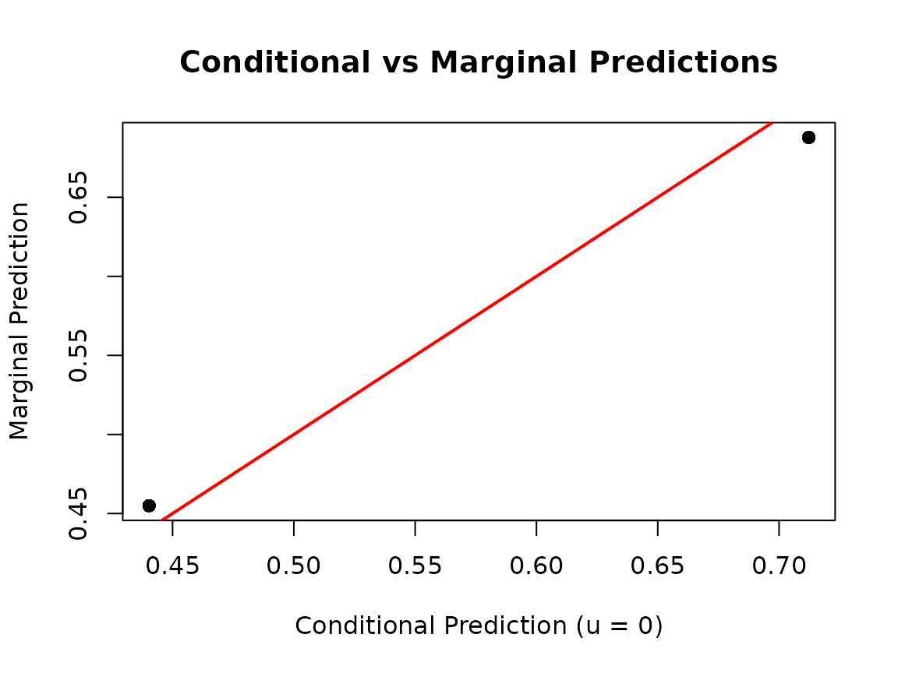
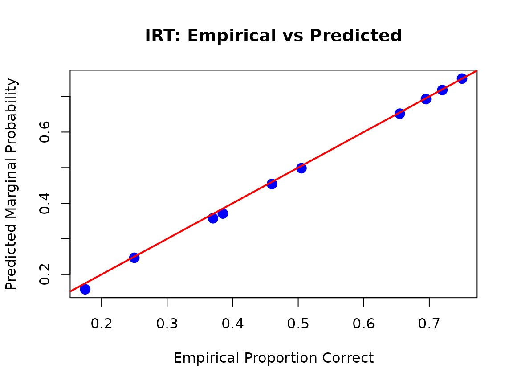
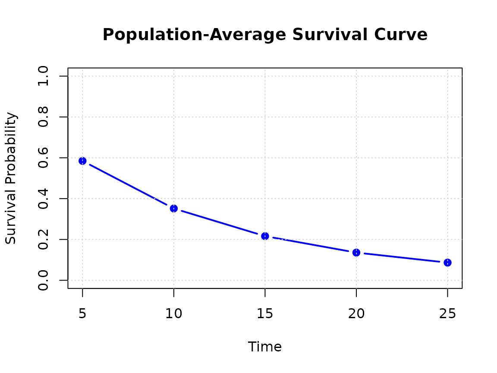

# Marginal vs Conditional Predictions in gllammr

## Introduction

This vignette explains the difference between **conditional** and
**marginal** predictions in generalized linear mixed models (GLMMs) and
other hierarchical models, and demonstrates how to compute both types of
predictions using gllammr.

## What are Marginal Predictions?

In mixed models, we distinguish between two types of predictions:

### Conditional Predictions

Conditional predictions are specific to a particular level of the random
effects. When we set the random effects to zero (u = 0), we get
predictions at the “average” cluster level:

    E[Y | X, u = 0] = g^(-1)(X'β)

where g^(-1) is the inverse link function.

### Marginal Predictions

Marginal predictions are averaged over the distribution of random
effects, giving us **population-level** predictions:

    E[Y | X] = ∫ g^(-1)(X'β + Z'u) f(u) du

where u ~ N(0, Σ_u).

### Why They Differ

For **nonlinear link functions** (logit, probit, log), marginal
predictions differ from conditional predictions due to Jensen’s
inequality:

    E[g^(-1)(X'β + Z'u)] ≠ g^(-1)(X'β)

For the **identity link** (Gaussian models), they are equal.

## Computing Marginal Predictions

gllammr uses Monte Carlo integration to compute marginal predictions:

1.  Draw S samples from the random effects distribution: u_s ~ N(0, Σ_u)
2.  For each sample, compute: ŷ_s = g^(-1)(X’β + Z’u_s)
3.  Average: E\[Y\|X\] ≈ (1/S) Σ_s ŷ_s

The default is S = 1000 samples (`n_sim = 1000`).

## Example 1: Binomial GLMM

Let’s start with a simple example where the difference between
conditional and marginal predictions is clear.

``` r

library(gllammr)
#> 
#> Attaching package: 'gllammr'
#> The following object is masked from 'package:stats':
#> 
#>     binomial
set.seed(123)

# Simulate data: treatment effect with clinic random effects
n_clinics <- 20
n_per_clinic <- 25
n <- n_clinics * n_per_clinic
u_clinic <- rnorm(n_clinics, 0, 1)

data <- data.frame(
  treatment = rep(0:1, each = n / 2),
  clinic = factor(rep(1:n_clinics, each = n_per_clinic))
)
data$success <- rbinom(
  n, 1,
  plogis(-0.2 + 0.8 * data$treatment + u_clinic[as.integer(data$clinic)])
)

# Fit binomial GLMM (stats::binomial uses the general TMB estimator)
fit <- gllamm(success ~ treatment + (1 | clinic),
              data = data,
              family = stats::binomial())

# Conditional predictions (at u = 0)
pred_cond <- predict(fit, type = "response", re.form = NA)

# Marginal predictions (averaged over clinics)
pred_marg <- predict(fit, type = "marginal", n_sim = 1000)

# Compare
summary(pred_cond - pred_marg)
#>      Min.   1st Qu.    Median      Mean   3rd Qu.      Max. 
#> -0.014592 -0.014592  0.004872  0.004872  0.024336  0.024336
```

**Key insight:** for the logit link, marginal probabilities are pulled
toward 0.5 relative to conditional probabilities when the random-effect
variance is substantial, because the inverse logit flattens in the
tails.

``` r

plot(pred_cond, pred_marg,
     xlab = "Conditional Prediction (u = 0)",
     ylab = "Marginal Prediction",
     main = "Conditional vs Marginal Predictions",
     pch = 19, col = rgb(0, 0, 0, 0.3))
abline(0, 1, col = "red", lwd = 2)
```



## Example 2: Ordinal Models

For ordinal outcomes, marginal predictions give us population-level
category probabilities.

``` r

set.seed(456)
data_ord <- data.frame(
  rating = sample(1:5, n, replace = TRUE),
  temp = rnorm(n),
  judge = factor(rep(1:n_clinics, each = n_per_clinic))
)

# Fit proportional odds model
fit_ord <- gllamm(rating ~ temp + (1 | judge),
                  data = data_ord,
                  family = ordinal(link = "logit"))

# Marginal category probabilities (n_obs x n_categories matrix)
pred_marg_ord <- predict(fit_ord, type = "marginal", n_sim = 500)

# Average marginal probabilities: expected population proportions
# of each rating category, accounting for between-judge variability
round(colMeans(pred_marg_ord), 3)
#> P(Y=1) P(Y=2) P(Y=3) P(Y=4) P(Y=5) 
#>  0.229  0.211  0.166  0.191  0.202
```

## Example 3: IRT Models

In IRT, marginal predictions give the proportion of the examinee
population expected to answer each item correctly.

``` r

set.seed(789)
n_persons <- 200
n_items <- 10

theta <- rnorm(n_persons)
b_item <- seq(-1.5, 1.5, length.out = n_items)
responses <- sapply(b_item, function(b) rbinom(n_persons, 1, plogis(theta - b)))

# Fit 2PL model
fit_2pl <- fit_irt(responses, model = "2PL")

# Marginal item response probabilities (one per item)
pred_marg_irt <- predict(fit_2pl, type = "marginal", n_sim = 1000)

# Compare to empirical proportions correct
emp_props <- colMeans(responses)

plot(emp_props, pred_marg_irt,
     xlab = "Empirical Proportion Correct",
     ylab = "Predicted Marginal Probability",
     main = "IRT: Empirical vs Predicted",
     pch = 19, cex = 1.5, col = "blue")
abline(0, 1, col = "red", lwd = 2)
```



Marginal IRT predictions are useful for item difficulty interpretation,
predicted test score distributions, and population-level assessment.

## Example 4: Explanatory IRT (EIRT)

EIRT allows predictions for **new items** based on item characteristics.

``` r

# Item data with predictors
item_data <- data.frame(
  item_id = 1:n_items,
  item_length = rnorm(n_items),
  content_area = factor(sample(c("Algebra", "Geometry"), n_items, replace = TRUE))
)

# Fit EIRT model
fit_eirt_model <- fit_eirt(responses,
                           item_data = item_data,
                           difficulty_formula = ~ item_length + content_area,
                           model = "2PL")

# Predict for new (not yet administered) items
new_items <- data.frame(
  item_length = c(-1, 0, 1),
  content_area = factor(c("Algebra", "Algebra", "Geometry"))
)

pred_new <- predict(fit_eirt_model,
                    newdata = new_items,
                    type = "marginal",
                    n_sim = 500)

data.frame(
  item_length = new_items$item_length,
  content_area = new_items$content_area,
  pred_prob = round(as.numeric(pred_new), 3)
)
#>   item_length content_area pred_prob
#> 1          -1      Algebra     0.274
#> 2           0      Algebra     0.389
#> 3           1     Geometry     0.704
```

**Use case:** automatic item generation, item bank calibration, and
predicting item performance before pilot testing.

## Example 5: Multinomial Models

For multinomial outcomes, marginal predictions give population-level
category probabilities (e.g., market shares).

``` r

set.seed(321)
data_mult <- data.frame(
  choice = sample(0:2, n, replace = TRUE),
  price = rnorm(n),
  quality = rnorm(n),
  person = factor(rep(1:100, length.out = n))
)

# Fit multinomial logit model with a person-level random effect
fit_mult <- fit_multinomial(choice ~ price + quality + (1 | person),
                            data = data_mult)

# Marginal category probabilities
pred_marg_mult <- predict(fit_mult, type = "marginal", n_sim = 500)

# Population-level choice shares
round(colMeans(pred_marg_mult), 3)
#> P(Y=0) P(Y=1) P(Y=2) 
#>  0.316  0.308  0.376
```

## Example 6: Survival Models

Marginal survival curves show population-average survival, integrating
over the frailty distribution.

``` r

set.seed(654)
n_hospitals <- 20
u_hosp <- rnorm(n_hospitals, 0, 0.5)

data_surv <- data.frame(
  treatment = rep(0:1, each = n / 2),
  hospital = factor(rep(1:n_hospitals, each = n / n_hospitals))
)
t_true <- rexp(n, rate = exp(-2.5 + 0.5 * data_surv$treatment +
                             u_hosp[as.integer(data_surv$hospital)]))
cens <- rexp(n, rate = 0.05)
data_surv$time <- pmin(t_true, cens)
data_surv$status <- as.integer(t_true <= cens)

# Fit Weibull survival model with hospital frailty
fit_surv <- fit_survival(Surv(time, status) ~ treatment + (1 | hospital),
                         data = data_surv,
                         distribution = "weibull")

# Marginal survival probabilities at selected times
times <- c(5, 10, 15, 20, 25)
surv_marg <- predict(fit_surv,
                     type = "marginal_survival",
                     times = times,
                     n_sim = 500)

# Population-average survival curve
avg_surv <- colMeans(surv_marg)

plot(times, avg_surv, type = "b",
     xlab = "Time", ylab = "Survival Probability",
     main = "Population-Average Survival Curve",
     ylim = c(0, 1), pch = 19, col = "blue", lwd = 2)
grid()
```



## When to Use Marginal vs Conditional Predictions

### Use Conditional Predictions When:

1.  **Cluster-specific inference**: you want the expected outcome for a
    specific cluster (a particular school, hospital, or person)
2.  **Comparing clusters**: you’re interested in between-cluster
    differences
3.  **Prediction for a new observation in an existing cluster**

### Use Marginal Predictions When:

1.  **Population-level inference**: expected outcome averaged across all
    clusters
2.  **Policy evaluation**: population-level treatment effects
3.  **Standardization**: comparing populations with different cluster
    compositions
4.  **New cluster prediction**: observations from a new, unseen cluster
5.  **Reporting to non-technical audiences**: marginal predictions often
    have a simpler interpretation

## Technical Details

### Computational Considerations

- The default `n_sim = 1000` balances accuracy and speed
- Increase (e.g., `n_sim = 5000`) for final/publication estimates
- Decrease (e.g., `n_sim = 100`) during exploration

### Standard Errors

For GLMMs you can request Monte Carlo standard errors:

``` r

pred_with_se <- predict(fit, type = "marginal", n_sim = 500, se.fit = TRUE)
str(pred_with_se)
#> List of 2
#>  $ fit   : Named num [1:500] 0.464 0.464 0.464 0.464 0.464 ...
#>   ..- attr(*, "names")= chr [1:500] "1" "2" "3" "4" ...
#>  $ se.fit: Named num [1:500] 0.00865 0.00865 0.00865 0.00865 0.00865 ...
#>   ..- attr(*, "names")= chr [1:500] "1" "2" "3" "4" ...
```

### Special Case: Gaussian Models

For Gaussian models with identity link, marginal and fixed-effects-only
predictions coincide (no Monte Carlo error):

``` r

set.seed(987)
data_g <- data.frame(
  y = rnorm(200), x = rnorm(200),
  group = factor(rep(1:20, each = 10))
)
fit_gauss <- gllamm(y ~ x + (1 | group), data = data_g, family = gaussian())

pred_fixed <- predict(fit_gauss, re.form = NA)
pred_marg_g <- predict(fit_gauss, type = "marginal")

max(abs(pred_fixed - pred_marg_g))
#> [1] 0
```

## Supported Models

Marginal predictions are available for:

- **GLMM**: Gaussian, binomial, Poisson
- **Ordinal**: cumulative link models (`type = "marginal"`)
- **IRT**: Rasch, 2PL, 3PL, GRM, PCM, GPCM, NRM
- **EIRT**: including predictions for new items
- **Multinomial**: baseline-category logit
- **Survival**: exponential, Weibull (`type = "marginal_survival"`)

## References

- Skrondal, A., & Rabe-Hesketh, S. (2009). Prediction in multilevel
  generalized linear models. *Journal of the Royal Statistical Society:
  Series A*, 172(3), 659-687.
- Hedeker, D., & Gibbons, R. D. (2006). *Longitudinal Data Analysis*.
  Wiley.
- Zeger, S. L., Liang, K. Y., & Albert, P. S. (1988). Models for
  longitudinal data: a generalized estimating equation approach.
  *Biometrics*, 1049-1060.

## Summary

- **Marginal predictions** provide population-level inference by
  averaging over random effects
- For **nonlinear links**, marginal ≠ conditional (Jensen’s inequality)
- Use `type = "marginal"` with
  [`predict()`](https://rdrr.io/r/stats/predict.html) for any gllammr
  model
- Adjust `n_sim` to balance accuracy and computation time

For more information, see
[`?predict.gllamm`](https://drjoshmcgrane.github.io/gllammr/reference/predict.gllamm.md)
and the related predict methods.
